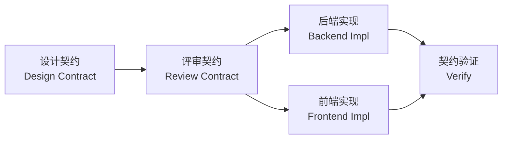

# API Contracts — ETF Surge

## 目的 / Purpose

Each new feature must start with an API contract document, **before any code is written**. Both frontend and backend implement against the same contract, ensuring consistency and reducing integration defects.

每个新功能必须先编写 API 契约文档，**然后才能开始编码**。前后端基于同一份契约实现，确保一致性并减少集成缺陷。

---

## 流程 / Workflow



| Step | 步骤 | 说明 |
|------|------|------|
| 1 | 设计契约 | 在 `api-contracts/<module>/` 下新建 `.md` 文件，定义路由、请求/响应结构 |
| 2 | 评审契约 | 确认契约清晰、完整、可验证 |
| 3 | 后端实现 | 对照契约实现路由和服务 |
| 4 | 前端实现 | 对照契约实现 API 调用层和 UI |
| 5 | 契约验证 | 前后端联调，逐字段核对响应是否符合契约 |

---

## 契约文件结构 / Contract File Structure

```
api-contracts/
├── README.md                  ← 本文件
├── contract_template.md       ← 契约模板
├── portfolio/                 ← 投资组合模块
│   ├── etfs.md                ← ETF CRUD
│   ├── calculate.md           ← 组合计算
│   ├── daily-pnl.md           ← 盈亏
│   ├── strategy.md            ← 策略检查与调仓
│   └── design.md              ← 组合设计
├── analysis/                  ← AI 分析模块
│   ├── llm-report.md
│   ├── llm-advice.md
│   ├── news-analysis.md
│   ├── portfolio-design.md
│   └── agents.md               ← 9 条 agent 链路 + Agent Registry 架构说明
├── news/                      ← 资讯模块
│   ├── headlines.md
│   ├── macro.md
│   ├── global.md
│   ├── stock.md
│   └── research.md
└── market/                    ← 行情模块
    ├── realtime.md
    ├── history.md
    ├── search.md
    ├── indicators.md
    ├── signal.md
    ├── chart.md
    └── indices.md
```

---

## 契约内容规范 / Contract Content Spec

每个契约文件必须包含以下部分：

1. **Overview** — 功能描述
2. **Endpoint** — HTTP method + path
3. **Request** — Headers, Query params, Body (JSON Schema)
4. **Response** — Status codes, Body (JSON Schema), Examples
5. **Error Codes** — 常见错误码及含义
6. **Checklist** — 前后端对照检查表

中文和英文双语书写，关键字段用代码块标明。
