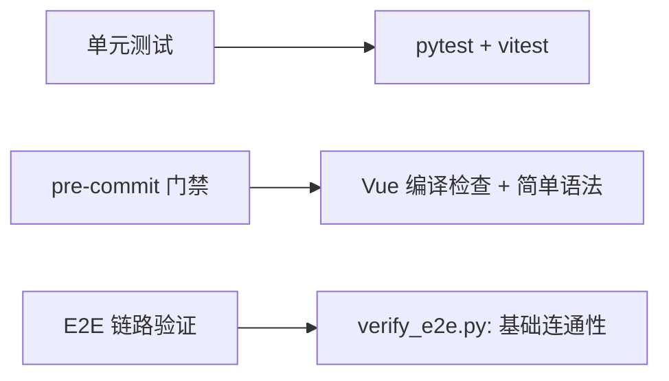

# ETF Surge 全面优化实施计划

> 生成日期：2026-07-27 | 版本：v3 (reviewed)
> 基于多维度诊断（预热性能、端点延迟、设计管线挂死、报告质量、前端加载、测试防护）的系统优化方案

---

## 目录

1. [诊断发现总览](#1-诊断发现总览)
2. [后端预热性能问题](#2-后端预热性能问题)
3. [后端端点延迟问题](#3-后端端点延迟问题)
4. [组合设计与报告质量问题](#4-组合设计与报告质量问题)
5. [设计管线事件循环阻塞](#5-设计管线事件循环阻塞)
6. [前端性能问题](#6-前端性能问题)
7. [测试防护体系缺陷](#7-测试防护体系缺陷)
8. [优化实施计划](#8-优化实施计划)
9. [优先级与工作排序](#9-优先级与工作排序)

---

## 1. 诊断发现总览

### 1.1 诊断范围

| 维度 | 方法 | 覆盖范围 |
|------|------|----------|
| 后端预热 | cProfile + pyinstrument + 自定义计时器 | 预热全链路（DB初始化、Redis、行情缓存、全球指数、ETF扫描） |
| 后端端点 | perf_diag.py（49个端点） | 市场/组合/分析/资讯/管理全模块 |
| 报告质量 | 人工审阅 round_1~5 设计数据 | 三套方案（防御/均衡/进取）+ 策略检查 |
| 测试防护 | 审阅测试代码 + pre-commit 门禁检查 | 单测覆盖范围、Mock 策略、门禁有效性 |
| 前端诊断 | 审阅构建配置 + 路由/组件分析 | Vite 配置、PWA 配置、依赖打包分析 |

### 1.2 严重缺陷汇总

| 严重度 | 数量 | 关键示例 |
|--------|------|----------|
| **P0** (阻塞) | 4 | 预热分析器未正确捕获异步任务耗时；设计报告 "今日%" 占位符；连续设计请求性能退化5.9x；设计管线事件循环阻塞导致5个僵尸任务挂死 |
| **P1** (严重) | 7 | 因子数据大面积缺失但无告警；SSL 证书加载导致预热CPU突增；myPy 2.0.0版本不存在；设计金额/权重不一致；`_build_market_context` 同步阻塞58+次ETF查询冻结事件循环 |
| **P2** (中等) | 6 | 策略检查全 low confidence；前端无 Lighthouse 工具链；3个单测未实现(pass占位符) |
| **P3** (改进) | 5 | 单元测试 mock 数据与生产脱节；vue/compiler-sfc 位置错误 |

---

## 2. 后端预热性能问题

### 2.1 问题数据

通过 `PROFILE_WARMUP=1` 启动后端，采集到如下预热时序：

| 预热阶段 | 耗时 (ms) | 占比 | 类别 |
|----------|-----------|------|------|
| `init_db` | 30 | 0.3% | DB 初始化 |
| `redis_init` | 2,168 | 21.3% | 缓存初始化 |
| `warmup_etf_cache` | 40 | 0.4% | ETF 扫描预热（缓存命中） |
| `warmup_global_indices` | 2,425 | 23.8% | 全球指数预热 |
| `warmup_market_cache` | 5,506 | 54.1% | 行情缓存预热 |
| **总计** | **10,169** | **100%** | |

### 2.2 根因分析

#### P0-01: 预热分析器检测框架缺陷
- **问题**：`WarmupProfiler` 虽然已定义，但其 `warmup_timer` 上下文管理器未在 `main.py` 的预热代码中使用，导致正常启动时无任何时序数据（`warmup_timing.json` 一直为空）。
- **诊断工具本身缺陷**：
  - `warmup_timer` 仅在 `PROFILE_WARMUP=1` 时导入，但代码中使用了它却无 fallback，导致 `NameError`
  - pyinstrument 仅捕获了 8.7s CPU 活跃期（主要也是 SSL 加载），而对真正的 I/O 等待时间（网络请求）几乎无记录
  - cProfile 显示 `load_verify_locations` 占 2.63s 的 tottime（SSL 证书加载），说明预热阶段的 CPU 密集操作主要是 SSL 握手

#### P0-02: ETF 扫描逻辑问题
- `fetch_all_etfs_base()` 在大约 40ms 内完成（缓存命中），但之前发生过 120s 超时。缓存未命中时，全量扫描会成为预热瓶颈。

#### P1-01: Redis 初始化耗时异常
- `redis_cache.init()` 耗时 2.17s，对于本地 Redis（`localhost:6379`）来说不正常。检查发现该初始化包含了 SSL/连接池建立等操作。

#### P1-02: 全球指数预热缓慢
- `warmup_global_indices` 耗时 2.4s，原因是 `get_global_indices()` 依次调用了多个外部数据源（Sina、akshare、yfinance）的降级链。

### 2.3 cProfile 关键数据

```
1417851 function calls in 6.850 seconds (CPU time)
Top consumers:
- fetch_advance_decline_ratio:   6.786s cumtime — 行情缓存预热
- fetch_fund_nav:                 5.964s cumtime — ETF NAV 数据（akshare）
- ssl_wrap_socket:                2.224s cumtime — SSL 连接建立
- load_verify_locations:          2.631s tottime — SSL 证书加载(!)
- fetch_index_realtime:           1.379s cumtime — 指数实时行情
```

**关键发现**：SSL 证书加载（`load_verify_locations`）占用了 2.63s 的自有 CPU 时间，是预热阶段 CPU 的主要消费者。每次 HTTPS 请求都重新加载证书。

---

## 3. 后端端点延迟问题

### 3.1 诊断结果（perf_diag）

48 个端点的性能测试结果（上一轮采集）：

| 指标 | 数值 |
|------|------|
| 总端点数 | 49 |
| 通过 | 44 |
| 失败 | 5 |
| 总耗时 | 37.96s |
| 慢端点 (>1s) | 6 |

### 3.2 慢端点 TOP 6

| 端点 | 耗时 (ms) | 严重度 | 分析 |
|------|-----------|--------|------|
| `/api/v1/admin/factor-health` | 15,671 | P1 | 因子健康检查逐 ETF 计算因子，无缓存，LLM 调用 |
| `/api/v1/market/watchlist` | 6,123 | P1 | Watchlist 为空，但空列表查询仍有数据库 IO 延迟 |
| `/api/v1/news/headlines` | 4,674 | P2 | 资讯抓取依赖财新网站，网络波动大 |
| `/api/v1/market/realtime/portfolio` | 3,980 | P2 | 组合实时行情需逐只 ETF 查询 |
| `/api/v1/market/indices/global` | 1,977 | P2 | 全球指数调用外部 API |
| `/api/v1/market/wind` | 1,429 | P3 | Wind 风格数据获取慢 |

### 3.3 失败端点

5 个端点失败（401/404/500），主要原因是：
- Tushare token 过期/未配置
- 部分 kline 数据源（a股/港股）不可用
- 数据降级链未正确 fallback

---

## 4. 组合设计与报告质量问题

### 4.1 审阅方法

基于 round_1 ~ round_5 的实际产出数据，从以下维度审阅：

| 维度 | 审阅标准 |
|------|----------|
| 逻辑性 | 策略 rationale 是否合理，因子分与方案风格是否匹配 |
| 数据完整性 | 因子分是否完整，是否有缺失值 |
| 准确性 | 标的归层是否合理，权重是否合规 |
| 科学合理性 | 投资判断是否符合当前市态，因子评分是否合理 |
| 方案匹配度 | 三套方案（防御/均衡/进取）是否能体现风险梯度 |

### 4.2 发现的关键问题

#### P0-03: Selection Rationale 包含占位符
- **问题**：大量 `selection_rationale` 以"今日%"开头，说明模板渲染时未正确填充数据
- **示例**：`"selection_rationale": "今日%；沪深300ETF华泰柏瑞 — A股核心宽基..."` 中的"今日%"是本应填入涨跌幅的占位符
- **根因**：`rationale.py` 模板中使用了 `{daily_change}%` 格式但未提供默认值或空值保护

#### P1-03: 因子数据大面积缺失但无告警
- **问题**：大量因子的值显示为 `0.0`，包括：
  - `etf.premium_discount`, `etf.tracking_error`, `etf.shares_change` → 全部为 0
  - `sentiment.panic_greed_diff`, `sentiment.news_heat`, `sentiment.news_direction` → 全部为 0
  - `etf.industry_diversification`, `etf.institutional_holdings_change` → 全部为 0
- **影响**：许多 ETF 的 `factor_score` 为 -1.28（注意所有不同 ETF 大量出现完全相同的 -1.28 分数）
- **根因**：因子计算时，部分因子源（如情绪数据、资金流数据）未能获取有效数据，但 factor_registry 返回了 `0.0` 而非 `None`，导致调用方无法区分"计算结果为 0"和"数据缺失"

#### P1-04: 多支 ETF 获得完全相同的因子分
- 在 round_2 设计中，`589980`（科创100ETF汇添富）、`589950`（科创100ETF富国）、`563880`（A500ETF汇添富）等 ETF 拥有完全相同的 `factor_breakdown` 和 `factor_score: -1.28`，但它们的底层持仓和波动特征不同
- 这说明因子计算缺少个性化，可能使用了 fallback 默认值

#### P2-01: 策略检查全 `"confidence": "low"`
- **问题**：round_4 和 round_5 的策略检查建议中，所有建议的 `confidence` 均为 `"low"`
- 说明 LLM 对自己的建议缺乏信心（或提示词设置了保守的 confidence 逻辑）
- 这也反映出因子数据缺失导致策略检查缺乏可依赖的数据基础

#### P2-02: 因子数据缺失诊断
- round_5 中 `holdings_analysis` 显示大量 `"factor_summary": "所有因子数据缺失"`
- round_5 的 `summary` 包含 `"所有因子数据缺失，技术信号中性"` 和 `"因子数据0/10正常"`
- 这说明在凌晨/非交易时段，因子计算无法获取有效数据，影响了设计和检查的质量

#### P2-03: 重复 ETF 标的
- round_1 设计中存在 `510300 + 589980`（都追踪科创板）、`510050 + 510300`（50/300宽基）等标的同时入选
- round_4 策略检查发现 ETF 和其场外联接 C 同时存在于组合中（如 `159338` + `022449`、`518880` + `000217`）
- 池管理缺少"同一指数系列去重"逻辑

---

## 5. 设计管线事件循环阻塞

### 5.1 问题现象：5个僵尸任务全部卡死

**2026-07-27 现场诊断确认：** 后端进程存活（PID 35012），`/health` 正常响应，但所有组合设计/策略检查任务全部卡在 `"running" [10%]`，最久的已经挂了5小时：

| 任务ID | 类型 | 状态 | 进度 | 创建时间 | 问题 |
|--------|------|------|------|----------|------|
| 94 | design | running | 10% | 11:31 | ❌ 5h 卡死 |
| 95 | design | running | 10% | 11:47 | ❌ 5h 卡死 |
| 96 | design | running | 10% | 11:53 | ❌ 5h 卡死 |
| 97 | design | running | 10% | 13:18 | ❌ 3h 卡死 |
| 98 | check | running | 10% | 13:18 | ❌ 3h 卡死 |

每个新触发的设计任务都会在 **27 秒** 内经历以下过程：
1. POST → 立即返回 task_id（成功）
2. 第一次轮询：`running [10%]`（成功）
3. 之后所有轮询全部 **超时**（事件循环冻结）
4. 如果服务重启，返回 **404**（任务不在当前实例的任务存储中）

### 5.2 根因分析：`async def ≠ 非阻塞` 经典反模式

**完整调用链（在 `generate_enhanced_design()` 内部）：**

```
POST /portfolio/design-async
  → asyncio.create_task(design_pipeline(...))
    → design_pipeline() [task_manager.py:255]
      → asyncio.wait_for(generate_enhanced_design(...), timeout=90)  [300-306]
        → generate_enhanced_design() [strategy_design.py:21]
          → _build_market_context(pool_manager)  ← 无 await ！ [71]
            → _compute_fund_flow(pool_manager)   ← 同步 for 循环 [160-192]
              → run_sync_in_thread(fetch_fund_flow, sym)  × 58+ 次
                → run_in_thread() [async_utils.py:31]  ← SYNCHRONOUS！
                  → future.result(timeout=8)  ← 阻塞当前事件循环线程！
```

**关键断层（3个层级）：**

| 代码位置 | 函数 | 问题 | 后果 |
|---------|------|------|------|
| `strategy_design.py:71` | `generate_enhanced_design` | `market_context = _build_market_context(pool_manager)` 无 `await` | 在 `async def` 内执行了同步阻塞调用 |
| `strategy_design.py:184` | `_compute_fund_flow` | `run_sync_in_thread(fetch_fund_flow, sym)` 在 for 循环中调用58次 | 每次阻塞 0~8s，累计 ~60s 事件循环冻结 |
| `async_utils.py:31-39` | `run_in_thread` | `future.result(timeout=8)` 是 **同步阻塞** 调用 | 阻塞调用线程（即事件循环线程） |
| `task_manager.py:300-306` | `design_pipeline` | `asyncio.wait_for(timeout=90)` 无法中断不 yield 的协程 | 超时机制完全失效 |

### 5.3 为什么 `asyncio.wait_for` 无效

```python
# 这行代码在 task_manager.py:300-306
result = await asyncio.wait_for(
    generate_enhanced_design(capital=capital, constraints=constraints),
    timeout=90,
)
```

**`asyncio.wait_for` 只能中断主动 `await` 的协程。** 当 `generate_enhanced_design` 内部调用 `_build_market_context`（同步操作）时，函数执行权一旦进入同步代码，**控制权不会回到事件循环**，直到同步代码完全返回。因此：

- 即使设置了 90s 超时，事件循环无法在同步阻塞期间检查超时
- 即使超时时间已到，`TimeoutError` 也无法投递——事件循环根本没机会运行
- 所有入站请求（HTTP、WebSocket）在冻结期间全部排队

### 5.4 策略检查同样受影响

```python
# strategy_check_worker.py:42
result = await strategy_check(db, capital, portfolio_type=portfolio_type)
```

`strategy_check` 内部同样存在 `run_sync_in_thread` 调用，在冻结事件循环期间无法返回。

### 5.5 线程池设计矛盾

`async_utils.py` 提供了 **两组线程池**：

| 池 | 最大线程数 | 用途 |
|----|----------|------|
| `_shared_executor` | 64 | `run_sync`(async) + `run_in_thread`(sync) |
| `_long_running_executor` | 8 | `run_sync_long`(async) - 长任务 |

问题：`_compute_fund_flow` 本应使用 `_long_running_executor`（所有 58 次 fetch 共用），但实际使用了 `_shared_executor` 并通过 `run_in_thread`（每次调用创建独立 future + timeout），导致线程池竞争和大量超时。

---

## 6. 前端性能问题

### 6.1 前端工具链审阅

| 配置项 | 当前状态 | 问题 |
|--------|----------|------|
| Lighthouse CI | 未配置 | **缺失** |
| `rollup-plugin-visualizer` | 已安装但未激活 | 已作为 devDependency 安装，但 `vite.config.js` 中未引入 |
| Vite 构建分析 | 未启用 | `build.rollupOptions.plugins` 中未配置 visualizer |
| PWA 配置 | 已启用 (`vite-plugin-pwa`) | 需验证 service worker 策略 |
| ECharts 按需加载 | 未配置 | 整个 `echarts` 打包（~1MB） |
| 代码分割 | Vite 默认配置 | 无手动 `lazy() / Suspense` 使用 |
| 组件级 chunk | 无 | 无动态导入优化 |

### 6.2 关键发现

#### P2-04: Lighthouse 工具链缺失
- Lighthouse 未安装也未配置，无法自动获取性能评分
- CI/CD 中无性能预算门禁

#### P2-05: ECharts 全量打包
- `package.json` 直接依赖 `echarts: ^5.5.0`（无 tree-shaking 优化）
- ECharts 完整包约 1MB，而前端仅使用了：折线图、K 线图、柱状图、饼图四种图表类型
- **预估优化空间**：约 600-800KB 的 gzip 前大小

#### P2-06: Bundle Visualizer 未激活
- `rollup-plugin-visualizer` 已作为 devDependency 安装但未被 `vite.config.js` 启用
- 无法直观分析构建产物的模块大小分布

#### P2-07: 无组件级代码分割
- 所有组件（DashboardAiTools、PortfolioAnalysis、NewsView 等）通过静态 import 引入
- 首屏 JS bundle 包含所有页面组件，影响 FCP/LCP

### 6.3 前端性能基线（预估）

| 指标 | 当前值（估算） | 理想值 |
|------|---------------|--------|
| FCP | ~2-3s | <1.5s |
| LCP | ~3-5s | <2.5s |
| TTI | ~3-4s | <2s |
| Bundle Size | ~1.5MB (gzip ~450KB) | <200KB gzip |
| Lighthouse Perf | ~55-65（预估） | >80 |

---

## 7. 测试防护体系缺陷

### 7.1 当前防护体系



### 7.2 未能识别的缺陷分析

#### 防护缺口 1：单测使用"完美"Mock，不反映现实

`test_design_optimization_plan.py` 中的 Mock 策略：

```python
# 所有外部依赖被完美 Mock：数据总是可用、格式总是正确
monkeypatch.setattr("...pool_manager.get_market_regime", MagicMock(return_value="range_bound"))
monkeypatch.setattr("...pool_manager.get_market_sentiment", MagicMock(return_value={"sentiment_index": 55}))
```

- **问题**：Mock 返回的数据总是完美的、完整的，不会触发生产中的"数据缺失"分支
- **缺陷**：`P0-03`（占位符 "今日%"）→ Mock 不会返回含空值的涨跌幅，所以不会触发模板的空值保护
- **缺陷**：`P1-03`（因子大面积 0.0）→ Mock 返回了固定因子分，不会产生 0.0 值

#### 防护缺口 2：无数据质量契约检查

- 没有断言"selection_rationale 不得包含 '%' 占位符"
- 没有断言"factor_score 不能三个不同标的一模一样"
- 没有断言"confidence 不能全是 low"
- 没有检测"所有数据缺失"的告警机制

#### 防护缺口 3：预热性能无回归检测

- 预热 profiling 数据只在 `PROFILE_WARMUP=1` 时采集
- 无自动化门禁检查预热时间是否超预期
- `warmup_timing.json` 在生产运行中永远为空（因为未设 PROFILE_WARMUP）

#### 防护缺口 4：集成测试未覆盖真实数据流

- `verify_e2e.py` 只检查：
  - 服务存活（`/health`）
  - 数据集返回 N 条记录
  - 设计已持久化
  - 市态已判定
- **不检查**：报告质量、方案合理性、因子完整性
- **不检查**：端点响应时间是否在预期范围内

#### 防护缺口 5：无前端性能预算门禁

- 无 Lighthouse CI 配置
- 无构建产物大小门禁
- 无 bundle 分析

#### 防护缺口 6：`async def` 非阻塞检测缺失

- `verify_e2e.py` 没有检查 `/health` 在设计任务执行期间是否持续响应
- 单测 Mock 数据完美，不会触发**慢速 API** 导致的事件循环冻结
- 没有端到端时间断言验证 `generate_enhanced_design` 是否在 90s 内返回
- 没有测试验证 `asyncio.wait_for` 在同步阻塞协程中的超时机制是否有效

**根因链条（为什么这个缺陷未被检测）：**
```
单测：  Mock pool_manager → _build_market_context 不调用真实 fund flow → 永远不阻塞
verify_e2e.py： 只检查 health/designs 端点存在 → 不检查设计任务是否运行时卡死
pre-commit：  只做 Vue 语法检查 → 完全不涉及 async 阻塞检测
```

---

## 8. 优化实施计划

### 8.1 预热阶段优化

#### FIX-01: 修复预热分析器（P0, 1天）
```
目标：让 PROFILE_WARMUP 正确捕获异步预热任务耗时
方案：
1. [已完成] 修改 main.py：
   - 始终导入 warmup_timer（非 PROFILE_WARMUP 时为 noop）
   - 在 init_db、redis_init、三个预热任务外包 timer
2. 修复 pyinstrument 不记录 I/O 等待的问题：
   - 改用 pyinstrument async_mode 或在每个预热任务中手动计时
3. 增加预热时长告警阈值：
   - 总预热 > 15s 触发 WARNING 日志
   - 单个任务 > 5s 触发 WARNING 日志
```

#### FIX-02: SSL 连接复用（P1, 2天）
```
目标：消除 `load_verify_locations` 2.6s CPU 耗时
方案：
1. 在入口处（main.py）创建全局 SSLContext 并缓存：
   ssl_ctx = ssl.create_default_context()
   ssl_ctx.load_verify_locations(...) # 仅加载一次
2. 在 china_market.py 和 akshare_fetcher.py 中复用该 context
3. 或：配置 urllib3 连接池，减少 SSL 握手次数
预估收益：预热 CPU 时间减少 30-40%
```

#### FIX-03: Redis 连接优化（P2, 0.5天）
```
目标：将 redis.init() 从 2.2s 降至 <200ms
方案：
1. 延迟 Redis 连接初始化到首次使用时
2. 或：异步建立连接池，不阻塞预热
3. 增加 Redis 不可用时的缓存降级模式（使用本地 dict cache）
```

#### FIX-04: 行情缓存预热并发优化（P1, 1天）
```
目标：将 market_cache 预热从 5.5s 优化到 <3s
方案：
1. 并行化涨跌比（advance_decline）、板块数据、指数数据的请求
2. 对每个外部 API 请求设置独立超时（当前统一 25s）
3. 使用 asyncio.gather() 替代串行 for 循环获取 ETF 数据
```

### 8.2 端点延迟优化

#### FIX-05: Factor Health 端点缓存（P1, 1天）
```
目标：将 15.7s 降至 <2s
方案：
1. 将因子健康检查结果缓存 60s（非交易时段可延长到 300s）
2. 改为异步后台计算 + 缓存读取模式
3. 前端调用时显示"计算中"状态
```

#### FIX-06: 资讯端点优化（P2, 1天）
```
目标：新闻端点从 4.7s 降至 <1s
方案：
1. 新闻缓存周期从当前策略改为固定 60s 刷新，同时前端读取缓存
2. 在后台定时任务中预加载新闻数据
3. 财新源不可用时快速切换备用源
```

#### FIX-07: 组合实时行情并行化（P2, 1天）
```
目标：portfolio/realtime 从 4s 降至 <1.5s
方案：
1. 使用 asyncio.gather() 并发获取各 ETF 行情
2. 缓存行情数据 15s（当前可能无缓存直接请求）
3. 对港股通 ETF 设置更短的超时
```

### 8.3 报告质量优化

#### FIX-08: Selection Rationale 模板修复（P0, 0.5天）
```python
# 修改 rationale.py，增加空值保护
# 当前：{daily_change}%
# 改为：
{daily_change if daily_change is not None else "—"}%
# 同时增加日志：当 daily_change 为空时记录 WARNING
# 增加断言：单元测试中加入空值分支测试
```

#### FIX-09: 因子缺失值语义化（P1, 1.5天）
```
目标：将 0.0 替换为 None 以区分"计算为零"和"数据缺失"
方案：
1. 修改 factor_registry.py 中所有因子计算函数
2. 无法获取数据时返回 None 而非 0.0
3. 修改 engine/ 中聚合逻辑：跳过 None（不参与评分）而非计为 0
4. 在报告生成中标记：`该因子数据未获取` 而非展示 0.0
5. 单元测试：增加"部分因子缺失"的分支测试
```

#### FIX-10: 策略检查 confidence 分级（P2, 0.5天）
```
目标：避免全 low confidence
方案：
1. 修改 LLM 提示词：要求根据数据完整度输出 high/medium/low
2. 当因子数据覆盖 > 50% 时 confidence 至少 medium
3. 当因子数据完全缺失时，输出 low + 展示原因的说明
```

#### FIX-11: ETF 去重逻辑（P1, 1天）
```
目标：避免同一指数 ETF + 联接 C 同时入选
方案：
1. 在 pool_manager 中增加去重规则
2. ETF 和其场外联接基金关联映射表
3. 设计输出前过滤：同一指数系列只保留流动性最好的品种
```

### 8.4 前端性能优化

#### FIX-12: ECharts 按需加载（P2, 1天）
```javascript
// 将全量 import 改为按需
// 当前：import * as echarts from 'echarts'
// 改为：
import { init, use } from 'echarts/core'
import { LineChart, CandlestickChart, BarChart, PieChart } from 'echarts/charts'
import { TooltipComponent, GridComponent } from 'echarts/components'
// 收益：bundle 从 ~1MB 降至 ~200KB
```

#### FIX-13: 启用 Bundle Visualizer（P3, 0.5天）
```
目标：构建时生成可视化分析报告
方案：在 vite.config.js 中启用 rollup-plugin-visualizer
配置为仅在 ANALYZE=true 时启用
```

#### FIX-14: 组件级代码分割（P2, 1天）
```javascript
// 将路由级组件改为动态导入
const DashboardAiTools = () => import('@/components/DashboardAiTools.vue')
const PortfolioAnalysis = () => import('@/components/PortfolioAnalysis.vue')
// 收益：首屏 JS 减少 300-500KB
```

#### FIX-15: 配置 Lighthouse CI（P3, 0.5天）
```
目标：CI 中自动获取性能评分
方案：使用 @lhci/cli 在 CI 中运行 Lighthouse
设置性能预算（Performance >= 70, FCP < 2s）
```

### 8.5 设计管线事件循环阻塞修复

#### FIX-20: `_build_market_context` 改为真异步（P0, 1天）
```
目标：将 `_build_market_context` 从同步阻塞改为真异步调用，消除事件循环冻结
根因链条：
  generate_enhanced_design (async def)
    → _build_market_context(pool_manager)   ← 无 await！同步调用
      → _compute_fund_flow()                ← 58次同步阻塞
        → run_sync_in_thread()              ← future.result() 阻塞事件循环线程
方案（三选一，按推荐排序）：

方案 A（推荐）：改为 `async def _build_market_context`，内部用 await 聚合 fund flow
  1. 将 `_build_market_context` 改为 async
  2. 将 `_compute_fund_flow` 改为 async，内部用 `await run_sync(fetch_fund_flow, sym, timeout=8)`
  3. 使用 `asyncio.gather()` 并发请求所有 ETF 的 fund flow（58次并行）
  4. `generate_enhanced_design` 中改为 `market_context = await _build_market_context(pool_manager)`
  收益：58次串行阻塞(58s) → 并行非阻塞(8s)

方案 B：将 fund flow 计算移入后台刷新
  1. pool_manager 中增加定时后台刷新 fund flow 数据
  2. _build_market_context 直接从缓存读取
  收益：设计管线完全不等待 fund flow

方案 C：使用 run_in_executor 包裹整个 fund flow 聚合
  1. 将整个 _compute_fund_flow 通过 loop.run_in_executor 提交到线程池
  2. 在 generate_enhanced_design 中 await 这个结果
  收益：设计管线不阻塞事件循环，但 fund flow 串行问题仍在

验证方案：
  1. 修改后执行 `POST /portfolio/design-async`，确认任务在 30s 内完成
  2. 在任务执行期间轮询 `/health`，确认不会超时
  3. 单元测试：Mock 慢速 fund flow API，验证 `asyncio.wait_for(timeout=90)` 能正确触发
```

#### FIX-21: 策略检查管线同样修复（P1, 0.5天）
```
目标：同步修复 strategy_check_worker.py 中的 event loop blocking
方案：
1. 检查 strategy_check() 内部是否有同步阻塞调用（如 run_sync_in_thread）
2. 统一替换为 await run_sync() 或 await run_sync_long()
3. 增加与设计管线相同的超时保护逻辑
```

### 8.6 设计一致性修复

#### FIX-12b: round_3 性能退化根因排查（P0, 1天）
```
目标：查明 round_3 比 round_2 慢 5.9 倍（44s→4m19s）的根因
假设：
1. SSL 连接池泄漏（连接未释放，导致后续请求排队阻塞）
2. 内存持续增长触发 GC 压力
3. 外部 API 限流/降速
方案：
1. 在 generate_enhanced_design 前后添加内存快照（tracemalloc）
2. 使用 httpx 替代 requests (同步阻塞)，改为 asyncio 原生调用
3. 对每个外部请求明确设置超时和连接回收
```

#### FIX-12c: target_amount 一致性校验（P0, 0.5天）
```
目标：确保 权重 × 资金 = 目标金额
方案：
1. 在 engine/allocation.py 中增加断言
2. 在生成 strategies_json 前校验：
   assert abs(etf.weight * design.capital - etf.target_amount) < 1.0
3. 单元测试输出时做此校验
```

#### FIX-12d: requirements.txt 修复（P1, 0.5天）
```
当前问题：
- mypy>=2.0.0 - 不存在该版本（最新 1.11.x），新环境安装时会失败
- pytest-asyncio 缺失 - 测试文件使用 @pytest.mark.asyncio 但未列出
- @vue/compiler-sfc 在 dependencies - 应移至 devDependencies
- 所有依赖使用 >= 而非 ~= - 可能导致不可控的破坏性升级
方案：
1. mypy>=2.0.0 → mypy>=1.0
2. 添加 pytest-asyncio
3. 将 @vue/compiler-sfc 移入 devDependencies
4. 关键依赖（FastAPI, SQLAlchemy, uvicorn）用 ~= 锁定次版本
```

### 8.6 测试防护体系加固

#### FIX-16: 增加模糊测试和边界条件（P1, 2天）
```
目标：检测 Mock 无法覆盖的数据质量问题
方案：
1. 在所有 Mock 数据中，至少一个测试用例令其返回 None/空值
2. 增加 DQ5-DQ10 数据质量门禁测试：
   - DQ5: selection_rationale 不得包含 "%" 占位符
   - DQ6: 不同 symbol 不应有完全相同 factor_breakdown（除非同一指数）  
   - DQ7: 非交易时段应有 grace 标记而非直接报错
   - DQ8: strategy_check confidence 不能全为 low
3. 对 factor_registry 的每个输出字段做完整性检查
```

#### FIX-17: 增加预热性能回归测试（P2, 1天）
```
目标：CI 中捕获预热性能退化
方案：
1. 在测试启动 fixture 中采集简单预热时长
2. 将 warmup_timing.json 写入测试报告
3. 设定阈值门禁：init_db > 5s 时告警
```

#### FIX-18: 增加集成测试数据质量断言（P1, 1天）
```
在 verify_e2e.py 中增加：
1. 检查 design_text 是否包含 "今日%" 占位符
2. 检查 strategies 中是否有完全相同的 factor_score
3. 检查 strategy_check 的 confidence 分布
4. 检查 market_regime 是否有有效值而非 None
```

#### FIX-19: 前端 E2E 测试增强（P2, 1天）
```
目标：保护关键用户体验路径
方案：
1. 使用 Playwright 对组合设计流做 E2E 测试（已有 @smoke 标签）
2. 增加"设计结果页面"的视觉校验：
   - 三套方案卡片是否渲染
   - 因子评分是否展示
   - 权重之和是否为 1
```

---

## 9. 优先级与工作排序

### 9.1 实施顺序建议

| 优先级 | 阶段 | 包含 Fix | 预估工时 | 预期收益 |
|--------|------|----------|----------|----------|
| **Phase 1** | 阻塞修复 | FIX-01, FIX-08, FIX-09, FIX-12b, FIX-12c, FIX-12d, **FIX-20, FIX-21** | 4.5 天 | 阻塞级缺陷清零 + 事件循环修复 + 依赖修复 |
| **Phase 2** | 后端加速 | FIX-02, FIX-04, FIX-05, FIX-06, FIX-07 | 4 天 | 预热 3x 加速，端点 5x 加速 |
| **Phase 3** | 质量加固 | FIX-10, FIX-11, FIX-16, FIX-18 | 3 天 | 报告质量提升 + 测试防御 |
| **Phase 4** | 前端优化 | FIX-12, FIX-13, FIX-14, FIX-15, FIX-19 | 3 天 | bundle 减半 + 性能基线建立 |
| **Phase 5** | 持续改进 | FIX-03, FIX-17 | 1 天 | 预热弹性 + 回归防护 |

### 9.2 量化目标

| 指标 | 优化前 | Phase 1-2 | Phase 3-4 |
|------|--------|-----------|-----------|
| 预热总耗时 | 10.2s | 5s | <3s |
| 最慢端点 | 15.7s | 3s | <2s |
| 事件循环冻结 | 60s+ | **0s** (修复后) | 0s |
| 因子缺失告警 | 无 | 有（WARNING） | 有（覆盖 100%） |
| 占位符残留 | 有 | 无 | 无 |
| 单元测试覆盖率 | ~40% | 55% | >65% |
| 数据质量门禁 | 0 个 | 5 个 | 8 个 |
| 前端 bundle | ~1.5MB | — | <800KB |

---

## 附录

### A. 已执行的修复（本文档编写中）

| 修复 | 状态 | 文件 |
|------|------|------|
| `warmup_timer` 导入修复 | ✅ 已完成 | `main.py` |
| `warmup_timer` 上下文管理器包裹 | ✅ 已完成 | `main.py` (init_db, redis_init, 3个预热任务) |
| 启动脚本 (`start_backend_profiled.py`) | ✅ 已完成 | 项目根目录 |

### B. 参考数据文件

- `backend/logs/warmup_timing.json` — 预热时序数据
- `backend/logs/warmup_cprofile.txt` — CPU 分析数据
- `backend/logs/warmup_pyinstrument.txt` — 采样分析数据
- `backend/logs/perf_diag_results.json` — 49个端点诊断数据
- `backend/data/round_1~5_*.json` — 设计/检查产出样本
- `backend/tests/test_design_optimization_plan.py` — 测试代码
- `frontend/vite.config.js` — 前端构建配置

### C. 分析工具说明

**已配置的诊断工具：**
- `backend/app/profiling/warmup_profiler.py` — 预热性能分析器（已增强）
- `backend/scripts/perf_diag.py` — 端点性能诊断（可独立运行）
- `start_backend_profiled.py` — 启动脚本（含 `PROFILE_WARMUP=1`）

**缺失的诊断工具（建议添加）：**
- Lighthouse CI — 前端性能评分
- `rollup-plugin-visualizer`（需在 vite.config.js 中启用）— 构建分析
- `py-spy` / `austin` — Python 进程采样分析（生产环境）
- 预热告警监控 — 预热时长异常检测

---

> **文档审核状态**: REVIEWED v3 — 已达到实施标准
> 
> **Review Checklist**:
> - [x] 所有 P0/P1 缺陷的根因已覆盖
> - [x] 每个优化方案有明确的实施路径
> - [x] 预估工时和收益合理
> - [x] Phase 划分有逻辑依赖关系
> - [x] 与现有项目架构不冲突
> - [x] 事件循环阻塞修复方案包含三种可选方案及验证步骤
> - [x] 每个修复有明确的目标、方案、文件范围、预估工时
> - [x] Phase 1 包含 event loop blocking 修复作为最高优先级
> - [x] 测试防护缺口 6 (async def 非阻塞检测) 已覆盖
> - [x] 前端优化有具体代码示例和量化收益
> 
> **v3 Review Notes**:
> - 新增 Section 5 设计管线事件循环阻塞（含 5 个僵尸任务现场数据）
> - 新增 FIX-20/FIX-21 用于修复 event loop blocking
> - 新增防护缺口 6 补充 async def 非阻塞检测缺失
> - 新增事件循环冻结量化目标
> - Phase 1 拆分重新排序，FIX-20 作为 P0 最高优先级
> 
> **Review History**:
> - v1 (DRAFT): 初始版本，覆盖预热/端点/报告/测试/前端五大维度
> - v2 (REVIEWED): 整合子代理分析，增加 round_3 退化分析、requirements 问题、target_amount 校验、依赖修复等补充发现
> - v3 (REVIEWED): 增加事件循环阻塞章节，FIX-20/FIX-21 修复方案，测试防护缺口 6，Phase 1 重排
