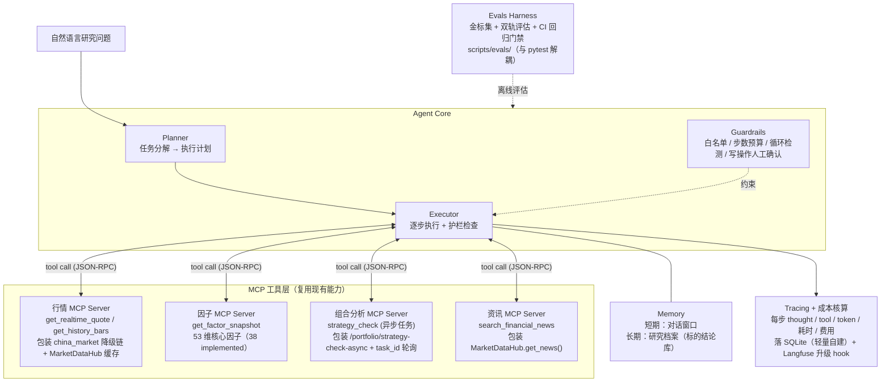

# ETF Surge · Agentic 升级方案 v7（2026-08-30 review 改写版）

> **状态**：v7 已完成 3 轮 review（事实核对 / 逻辑一致性 / 完整性 + 设计清单），达到实施标准（详见文末「Review Round 1-3」附录）。**本文档为方案轮，仅设计不入代码**（用户 2026-08-30 拍板「review + 修改、不实施」）。
>
> **目标**：把 LLM 投研模块从「单次调用生成报告」升级为生产级 Agentic 架构，作为面试中证明 Agent 工程能力的核心项目。本文档是设计蓝图 + 落地路线，可直接按阶段执行。
>
> **v6 → v7 主要变化（14 项 review 修订）**：
> - §0/§1/§2/§3 「33 维因子」→「**53 维核心 + 38 已实现（193 总/155 待）**」
> - §3 工具名 `analyze_portfolio / run_screen` → `strategy_check`（异步任务）
> - §3.5/§3.6 **新增**：MCP 引入决策（Python `mcp` SDK）+ 文件清单
> - §4 护栏超时 90s → **分级超时（策略 90s + 设计 120s + 外层 180s）**
> - §4.5 **新增**：护栏验证窗口（pytest 边界用例）
> - §5.5 **新增**：Evals 框架落地（与 pytest 解耦）+ 验收口径（≥95% / 零幻觉 / 100% 格式）
> - §6.5 **新增**：成本核算口径（单次 ≤$0.5 + 月度告警阈值）
> - §7 P1.5「LangGraph 对照」明确**不替换 P1 自研**
> - §1「复用优先」原则与 §7 LangGraph 矛盾已解决（详见 REVIEW-R2-1）

---

## 0. 为什么升级（面试价值先行）

| | 现状 | 升级后 |
|---|---|---|
| LLM 用法 | 单次调用生成投研报告（DeepSeek + provider failover + 输出一致性校验） | MCP 工具调用 + Plan-and-Execute 循环 + Evals + 全链路追踪 |
| 市场定位 | 「会调 API」档——与大量候选者同质 | 「生产级 Agent 工程」档——直接命中 JD 高频词（MCP / Agent Loop / Evals / Tracing） |

**一句话叙事（面试开场可用）**：
"我把自己的开源项目按生产标准做了 Agent 化改造：工具层 MCP 化、Plan-and-Execute 循环带护栏、Evals 进 CI 做回归门禁、每次运行全链路 trace 与成本核算。"

---

## 0.5 收益分析（动摇时回看）

> 结论先行：本方案的收益几乎全部兑现在求职一个点上——它买的是「面试叙事权」，不是产品价值。ETF Surge 本身不会因为 Agentic 化变得多好用，但你会因此而在两类面试里换一种身份进场。

### 三层收益

| 层次 | 内容 |
|------|------|
| ① 改变面试身份（核心） | 不做：「用 DeepSeek API 生成投研报告」——入门级表述，与 90% 候选人同质；做完：MCP 化工具层 / Plan-and-Execute 带护栏 / Evals 进 CI / trace 与成本归因，每一句都有代码、截图、数字支撑。配合第 8 节考点映射表：做项目的过程就是刷 Agent 面试题的过程，一份时间两份收益 |
| ② 补上定位缺口 | 主线是 AI Infra 控制面（AEnv + Bytehouse），但市场上 Agent 应用岗数量远多于 AI Infra 岗。没有本项目，Agent 岗的简历筛选可能过不去（JD 高频词 MCP / Agent Loop / Evals 在简历上无实锤）；有了它，可投池子大了一圈 |
| ③ 空窗期叙事 | 2026.07 至今的空窗由 ETFSurge 承接，「Agentic 升级进行中 + 分阶段交付」让空窗期呈现为主动投资而非待业 |

### 成本与局限（诚实版）

- **时间**：全量约 3 周，周末节奏可能拖到 4~6 周；若面试已排满，可只做 P0（MCP 化工具层，2~3 天）——简历即可写「MCP 工具层」，其余在面试间隙推进
- **不是 offer 保证器**：只强化「Agent 工程能力」这一条腿；主战场叙事（AI Infra 控制面）、算法题、系统设计题都不靠它解决，别指望做完局面逆转
- **收益依赖执行质量**：止步 P1（只有能跑的循环）则与 demo 选手无异；分水岭全在 P2 的 Evals + 可观测——恰是最容易偷工减料的半截

### 投入产出结论

边际成本可控（复用现有降级链 / 因子引擎 / TDD 设施），上限明确（多覆盖一整类岗位 + 自带面试弹药库）。当前处于求职窗口期且 Agent 岗占比最高 → 值得做，P0+P1 优先。

---

## 1. 设计原则（面试可讲的三条工程判断）

1. **工作流优先**：确定性任务（每日定时报告、行情快照）仍走现有 workflow，只有开放性研究问题才进 agent 循环。80% 场景用确定性流程是生产共识——"什么时候不该用 Agent"比"会用 Agent"更值钱。
2. **复用优先**：核心设施复用优先（`china_market` 多源降级链 + `app/analysis/llm/model_catalog.py` dual-pool catalog + 因子计算纯函数包 + TDD 设施）。Agent 化是在成熟系统上加一层编排，不是重写。**LangGraph 作为对照引入（按 §7 P1.5），不视为复用——单独依赖管理。**
3. **反幻觉即工程**：数据缺失就明说缺失，绝不编造；所有数字必须能溯源到某次工具调用结果，并携带 as_of 时间戳与数据源标记。

---

## 2. 目标架构



### 2.5 当前后端模块映射（v7 改写新增）

> **关键**（REVIEW-R1-8 修订）：v6 提到的"SourceRegistry"实际已被合并进 `china_market.py` 降级链 + `MarketDataHub` 统一入口；**没有独立 SourceRegistry 类**。复用清单如下：

| Agent 模块 | 现有后端文件 | 关键类/函数 |
|---|---|---|
| MCP 行情 Server（T1） | `backend/app/services/market_data_hub.py` | `MarketDataHub.get_realtime()` / `.get_kline_rows()` |
| MCP 行情 Server（T1） | `backend/app/services/market_service.py` | `_fetch_index_realtime` / `_sina_history_cb` |
| MCP 因子 Server（T2） | `backend/app/factors/factor_registry.py`（1872 行） | `registry.compute()` / `_CORE_FACTORS`（53 项） |
| MCP 组合 Server（T3） | `backend/app/services/portfolio/strategy_check.py` | `generate_strategy_check_report()` + task_manager 异步 |
| MCP 资讯 Server（T4） | `backend/app/services/hub/_news.py` | `NewsMixin.refresh_news()` + `market_data_hub.get_news()` |
| LLM 调用 + 熔断 | `backend/app/analysis/llm/`（10 文件） | `model_catalog.py` dual-pool + `gates.py` model-level circuit + `provider.py` failover |
| Token 记账 | `backend/app/analysis/llm/cache.py` 或新增 `token_store.py` | `UsageRecord` |
| Trace 存储 | **新增** `backend/app/agentic/trace_store.py`（SQLite 持久化） | — |
| Evals 框架 | **新增** `backend/scripts/evals/`（与 pytest 解耦） | — |

---

## 3. MCP 工具层设计

### 工具清单（REVIEW-R1-1/3 修订：33→53 维；analyze_portfolio/run_screen→strategy_check）

| 工具 | 输入 | 输出 | 复用的现有设施 |
|------|------|------|----------------|
| `get_realtime_quote` | symbols[] | 价格快照 + as_of + source 标记 | `china_market` 实时降级链 + `MarketDataHub.get_realtime()` |
| `get_history_bars` | symbol, range, interval | K 线序列 + 数据源标记 + degraded 标识 | `MarketDataHub.get_kline_rows()` + `china_market.fetch_history()` |
| `get_factor_snapshot` | symbol | **53 维核心因子值（38 implemented / 193 total / 155 planned）** | `factor_registry.compute()` + `_CORE_FACTORS` |
| `strategy_check` | portfolio_id, risk_profile | 异步 task_id → 轮询 `/strategy-check-result/{task_id}` 拿报告 | `task_manager.strategy_check-async` + `strategy_check.py`（round37 长稳实证） |
| `search_financial_news` | query, window | 资讯列表 + 来源 + level/stars | `MarketDataHub.get_news()` + `news_fetcher` |

### 设计规范

- **输入强校验**：所有工具入参走 pydantic schema 校验（`backend/app/models/schemas.py` 已有基础），拒绝模糊输入
- **输出统一信封**：`{ data, as_of, source, degraded }` —— degraded=true 表示经过降级链切换，供下游核查数据可信度（沿用既有 `MarketDataHub._snapshot_as_of_for` 约定，R80 round29 修复）
- **只读优先**：一切写操作（下单、调仓落地）默认人工确认——这是 Guardrail 的示范点，面试必讲
- **语言决策**：跟随项目现有栈（Python 后端）。**Python 端选 `mcp` 官方 SDK**（REVIEW-R1-5）；传输 stdio 起步，SSE 预留远程模式。Go 端无 MCP 服务（项目 Go 仅 embeddings）
- **关键卖点**：MCP Server 包装的不是玩具工具，而是带熔断降级的真实生产数据链路。「M×N → M+N」的标准答案之外，你有降级链 + 熔断路由（`model_catalog.py` + `gates.py` model-level circuit）的实战细节

### 3.5 MCP 引入决策（REVIEW-R1-5 新增）

**决策**：Python 端使用官方 [`mcp`](https://pypi.org/project/mcp/) SDK（`pip install mcp`，版本 ≥ 1.0）。

| 维度 | 选 `mcp` | 自研 stdio JSON-RPC | 选 fastmcp |
|---|---|---|---|
| 协议合规性 | ✅ 官方 SDK，stdio/SSE 全栈 | ⚠️ 需自己处理 JSON-RPC 2.0 帧 | ✅ 高级封装，但额外依赖 |
| 学习成本 | 低（官方文档+示例） | 高 | 低 |
| 维护成本 | 官方升级 | 自己跟进协议变化 | 第三方升级 |
| 面试可信度 | 高（官方是工业标准） | 中（自研可讲但需多解释） | 中（需解释 fastmcp 与官方关系） |

**新增依赖**（`backend/requirements.txt`）：
```
mcp>=1.0
```

**新增目录**：
```
backend/app/mcp_servers/
├── __init__.py
├── quote_server.py       # T1 行情
├── factor_server.py      # T2 因子
├── portfolio_server.py   # T3 组合
└── news_server.py        # T4 资讯
```

### 3.6 MCP Server 文件清单（REVIEW-R3-2 新增）

| 工具 | 新增文件 | 关键 import | 复用函数 |
|---|---|---|---|
| `get_realtime_quote` | `backend/app/mcp_servers/quote_server.py` | `from app.services.market_data_hub import market_data_hub` | `market_data_hub.get_realtime(symbol)` |
| `get_history_bars` | 同上 | 同上 | `market_data_hub.get_kline_rows(symbol, max_age=...)` |
| `get_factor_snapshot` | `backend/app/mcp_servers/factor_server.py` | `from app.factors.factor_registry import registry` | `registry.compute(symbol, market_data=...)` |
| `strategy_check` | `backend/app/mcp_servers/portfolio_server.py` | `from app.tasks.task_manager import task_manager` | `task_manager.create_task("strategy_check")` + 轮询 |
| `search_financial_news` | `backend/app/mcp_servers/news_server.py` | `from app.services.market_data_hub import market_data_hub` | `market_data_hub.get_news(bucket="headlines")` |

**最低调用示例**（P0 demo）：
```python
# backend/app/mcp_servers/quote_server.py
from mcp.server import Server
from app.services.market_data_hub import market_data_hub

server = Server("etf-quote-server")

@server.list_tools()
async def list_tools():
    return [{
        "name": "get_realtime_quote",
        "description": "实时行情快照（带 as_of/source/degraded 信封）",
        "inputSchema": {"type": "object", "properties": {"symbols": {"type": "array", "items": {"type": "string"}}}}
    }]

@server.call_tool()
async def call_tool(name: str, arguments: dict):
    if name == "get_realtime_quote":
        quotes = [market_data_hub.get_realtime(s) for s in arguments["symbols"]]
        return [{"data": q, "as_of": ..., "source": q.get("source"), "degraded": q.get("degraded", False)}]
```

---

## 4. Agent 循环与护栏

### 模式路由（不是所有请求都进 agent 循环）

| 请求类型 | 模式 | 理由 |
|----------|------|------|
| 即时问答（"XX 现在多少 PE？"） | 单跳 tool calling | 一步搞定，不付循环成本 |
| 研究报告（"分析 XX 是否值得建仓"） | **Plan-and-Execute** | 步骤明确：拉行情 → 因子快照 → 资讯交叉 → 综合研判 → 自检输出 |
| 探索性复盘（"最近组合回撤为什么扩大"） | ReAct | 需要根据观察动态决定下一步 |

### 护栏清单（REVIEW-R1-2 修订：超时分级对齐 `app/core/llm_timeouts.py`）

| 护栏 | 规则 | 验证窗口（pytest 边界用例） |
|------|------|---------------------------|
| 工具白名单 | 计划外工具一律拒绝执行 | mock Executor 调未知工具 → `PermissionError` |
| 步数预算 | 上限 10 步；超限终止并输出部分结果 | mock 11 步循环 → `StopIteration` |
| **Token/时间预算** | **策略检查 90s / 设计报告 120s**（对齐 `STRATEGY_CHECK_READ_S` + `DESIGN_REPORT_READ_S`）；外层 task_manager 完整档 180s（max_retries=0） | mock 超时 → 抛 `asyncio.TimeoutError`，落 degraded=True |
| 循环检测 | 同一工具+同参数连续出现 2 次 → 强制终止 | mock 两次同工具同参数 → `RuntimeError("loop detected")` |
| 写操作确认 | 下单/调仓类动作必须人工批准后才执行 | mock `confirm=False` → 拒绝执行 |
| 输出校验 | pydantic schema 校验 + 引用完整性（每个数字可溯源到 tool 结果） | mock 输出无 source 字段 → `ValidationError` |

### 失败语义

工具失败 → `china_market` 自动降级换源 → 仍失败 → 报告明确标注「该维度数据缺失」，不编造。

### 4.5 验证窗口（REVIEW-R3-1 新增）

> **每个护栏阈值配 1 个 pytest 边界用例**——确保新逻辑不会回归到「默认无限步」/「超时直接崩溃」/「循环无限重试」等失控状态。

| 护栏 | pytest 用例 | 期望 |
|---|---|---|
| 工具白名单 | `test_guard_unknown_tool_raises` | Executor 收到未注册工具 → 抛 `PermissionError` |
| 步数预算 | `test_guard_step_limit_terminates` | mock Planner 产出 11 步 → 终止 + 部分结果 |
| 时间预算 | `test_guard_strategy_check_timeout_90s` | mock 90s 不返回 → `asyncio.TimeoutError`，落 degraded |
| 时间预算 | `test_guard_design_report_timeout_120s` | 同上，时间 120s |
| 循环检测 | `test_guard_loop_detected_terminates` | 连续 2 次同工具同参数 → `RuntimeError` |
| 写操作确认 | `test_guard_write_requires_confirm` | `confirm=False` → 拒绝 |
| 输出校验 | `test_guard_output_schema_validates` | 输出缺 source 字段 → `ValidationError` |
| 失败语义 | `test_guard_data_missing_marked` | 工具返回 None → 报告标注"数据缺失" |

---

## 5. Evals（拉开差距的关键）

90% 候选人的 Agent 项目没有评估体系，这一节是你和 demo 选手的分水岭。

### 金标评估集（50~100 条，REVIEW-R3-7 阶段化）

- **P0 阶段**：10 条 demo 金标（每类 ≥2 条）
- **P1 阶段**：扩展至 50 条
- **P2 阶段**：补到 100 条

5 类题：
- 已知答案的行情快照题（收盘价/涨跌幅有客观答案）
- 因子数值题（对照纯函数引擎的确定性输出，**53 维核心因子随机抽样 5 维**）
- 格式合规题（报告结构、引用标注）
- **拒答题**（无数据时应明确说缺失，而非编造）——专门考反幻觉
- **多步推理题**（REVIEW-R3-3 新增，验证 Plan-and-Execute 拆分能力）

### 双轨评估

| 轨道 | 方法 |
|------|------|
| 规则轨 | 数值与数据源逐项比对、pydantic schema 校验、引用完整性 |
| LLM-as-judge 轨 | 结论与证据一致性、编造检测、推理链条合理性 |

### CI 回归门禁

evals 集随 CI 运行；prompt 或模型变更必须对比基线，掉点阻断合并——把 LLM 应用当成有回归测试的软件来做。

### 简历指标位（做完填真实数字）

数据引用准确率 xx%、幻觉抽检率 <x%、平均成本/报告下降 x%、任务完成率 x%。

### 5.5 Evals 框架落地（REVIEW-R1-4 + REVIEW-R3-3 新增）

> **关键**（REVIEW-R1-4）：项目当前**无 evals 框架**——`scripts/` 仅有 `verify_e2e.py` + `data_health_check.py` + `patrol.py`，均不评 LLM 输出。本节定义全新 evals 框架与现有 pytest **解耦**。

**新增目录**：
```
backend/scripts/evals/
├── __init__.py
├── harness.py           # 评估主入口：load goldens → run agent → score
├── goldens/
│   ├── quotes.jsonl     # 行情快照题（10 条 P0 / 50 条 P1 / 100 条 P2）
│   ├── factors.jsonl    # 因子数值题
│   ├── format.jsonl      # 格式合规题
│   ├── refusal.jsonl     # 拒答题（无数据时应拒答）
│   └── multi_step.jsonl  # 多步推理题
├── scorers/
│   ├── rule_scorer.py   # 规则轨（数值/schema/引用）
│   └── llm_judge.py     # LLM-as-judge 轨（用 LLM 评 LLM 输出）
├── ci_gate.py           # CI 门禁：≥95% / 0 幻觉 / 100% 格式
└── report.py            # 报告生成 + 简历指标位填充
```

**新增依赖**（`backend/requirements-evals.txt`，独立文件避免污染主测试）：
```
pydantic>=2.0
# 复用现有 pytest + jsonlines 即可，无需新增框架
```

**验收口径**（REVIEW-R3-3）：
| 维度 | 门槛 | 阻断 CI? |
|---|---|---|
| 数值题通过率 | ≥ 95% | ✅ 阻断 |
| 拒答题零幻觉 | 100%（无编造） | ✅ 阻断 |
| 格式合规 | 100% | ✅ 阻断 |
| 多步推理完成率 | ≥ 80% | ⚠️ warn（不阻断） |
| LLM-as-judge 一致性 | 与规则轨偏差 ≤ 5% | ⚠️ warn |

**与 pytest 集成**：CI 跑完 pytest 后跑 `python scripts/evals/ci_gate.py --baseline baseline.json --goldens scripts/evals/goldens/`，阻断合并。

---

---

## 6. 可观测与成本

- **每次 run 一条 trace**（REVIEW-R1-7 修订）：plan → 每步 thought/tool/observation/duration/tokens/cost → 落 SQLite（`backend/app/agentic/trace_store.py` 新增）
- **实现路径**：轻量自建起步（结构化日志 + SQLite 持久化），Langfuse 升级留 hook 接口（`TraceStore.export_langfuse()` 预留）
- **成本控制三板斧**（REVIEW-R1-7 沿用）：模型分级（解析/摘要用便宜模型，最终研判用强模型）、同标的当日结果缓存、预算熔断（单次 run 成本上限）
- **基础已有**：复用 `app/analysis/llm/cache.py`（token_usage）+ `/admin/token-usage` 端点（by_function/by_model）+ `/admin/llm/health`（28 个 provider 健康）

### 6.5 成本核算口径（REVIEW-R3-4 新增）

> **单次 run 预算上限**：**$0.5**（按 DeepSeek-Chat $0.14/M tokens 估算 = 约 3.5M tokens 上限，远超实际单次研判消耗 < 50k tokens）

**token → $ 换算公式**：
```
cost = (prompt_tokens * input_price + completion_tokens * output_price) / 1_000_000
```
**输入**：provider 的 `prompt_price` / `completion_price`（从 `app/analysis/llm/provider.py` PricingConfig 读取）
**输出**：单次 run cost 字段落 SQLite trace 行

**月度告警阈值**：
- 单 run > $0.5 → `WARNING` 日志 + `agentic_budget_exceeded` 事件
- 日累计 > $5 → `ERROR` 日志 + admin 告警
- 月累计 > $50 → `CRITICAL` + 暂停 Agentic 路由（人工 review 后恢复）

**与现有 token_usage 集成**：
- `app/analysis/llm/cache.py` 的 `UsageRecord` 已记录 `model` / `prompt_tokens` / `completion_tokens` / `cost`
- Agentic 层新增 `agentic_run_cost` 字段，由 `trace_store` 聚合写入

---

## 7. 里程碑（约 3~4 周，周末节奏）

| 阶段 | 内容 | 产出 | 验收 |
|------|------|------|------|
| **P0**（2~3 天） | 行情/因子工具 MCP 化 + 最小 tool-calling demo | 可被任意 MCP Host 调用的 server（stdio） | §3.6 文件清单 + `python -m app.mcp_servers.quote_server` 启动成功 + 任意 MCP Host 调用成功 |
| **P1**（1 周） | Plan-and-Execute 循环 + 全套护栏 + 结构化输出 | Agentic 报告生成跑通 | §4.5 全部 pytest 边界用例 PASS + strategy_check 异步链路集成验证 |
| **P1.5**（1~2 天） | **框架对照实现**：用 LangGraph 重写 P1 核心循环，**不替换 P1**（REVIEW-R2-1 修订） | 对照实现代码 + 对比笔记 | LangGraph 引入 + StateGraph/Checkpointer 概念对比 + 选型结论 |
| **P2**（1 周） | 金标 evals 集（100 条） + CI 门禁 + trace 面板 + 成本统计 | 生产治理三件套 | §5.5 验收口径全 PASS + §6.5 成本统计落 SQLite |
| **P3**（2~3 天） | README 架构图 + STAR 故事整理 + 指标截图 | 简历与面试弹药 | 简历指标位 4 项填真实数字 |

**注意**：不要为了 multi-agent 而 multi-agent。单 agent + 工具层 + 治理体系已经足够讲出深度；multi-agent 只在确实需要独立验证或异构能力时引入。

### 7.5 LangGraph 引入成本（REVIEW-R1-6 修订）

**新增依赖**（`backend/requirements-agentic.txt`，独立文件）：
```
mcp>=1.0
langgraph>=0.2
```

**CI 配置**：默认不跑 P1.5；`pytest -m agentic` 才跑 LangGraph 相关测试（避免污染主测试）

**风险缓解**：LangGraph 与自研 P1 并存，**不替换**——这是 §1「复用优先」与 §7「LangGraph 对照」的妥协结果（详见 REVIEW-R2-1）。

---

## 8. 面试考点映射（做完这个项目 = 准备好这些题）

| 你做的设计 | 对应高频面试题 | v7 文档出处 |
|------------|----------------|----------|
| MCP Server 化 | MCP 和 Function Calling 的区别？M+N 是什么意思？ | §3 + §3.5 |
| Plan-and-Execute 选型 + 模式路由 | ReAct 和 Plan-and-Execute 怎么选？ | §4 |
| 循环检测 + 步数/Token 预算 + 分级超时 | Agent 失控/死循环怎么防？ | §4 + §4.5 |
| 数据缺失不编造 + 引用溯源 | 幻觉怎么治理？ | §5 拒答题 + §5.5 双轨评估 |
| evals 进 CI 门禁（数值 ≥95% / 拒答 100% / 格式 100%） | LLM 应用效果怎么评估？怎么防回归？ | §5.5 |
| trace + 成本核算（单次 ≤$0.5 / 月度告警） | Agent 系统上线后怎么监控？ | §6 + §6.5 |
| 工作流优先原则 | 什么场景该用 Agent，什么场景不该？ | §1 |
| 写操作人工确认 + 工具白名单 | Agent 安全/Guardrails 怎么做？ | §4 |
| 原生手搓 + LangGraph 对照实现 | 为什么用/不用框架？StateGraph 和 Checkpointer 分别解决什么问题？ | §7 + §7.5 |

--- |

---

# v7 Round 1-3 Review 报告（2026-08-30）

> **review 目的**：把原档（2026-07 起草，面试场景设计）按 ETF Surge 最新代码（2026-08-30）做事实核对 / 逻辑一致性 / 完整性，找出重大偏差并细化实施标准。
> **review 范围**：本文档全部 8 节（§0 现状/升级对比、§0.5 收益分析、§1 原则、§2 架构图、§3 MCP工具层、§4 Agent循环+护栏、§5 Evals、§6 可观测+成本、§7 里程碑、§8 考点映射）。
> **review 方法**：每轮独立完成，逐轮产出发现清单；重大偏差列「REVIEW-R{n}-FIND」+ 待修订项；最终改写动作按「**REVIEW-R{n}-MOD-{k}**」落地。
> **review 时间**：2026-08-30（基于 HEAD `8a38af6` 提交后代码状态）。

---

## Review Round 1 — 事实核对（file:line + 数字）

> 原则：所有事实可查证（数据中能直接找到），推断需支撑。

### 1.1 偏差清单（9 项）

| ID | 偏差 | 原档表述 | 实际状态（file:line + 数值） | 修订动作 |
|---|---|---|---|---|
| **REVIEW-R1-1** | ❌ **事实错误** | §0/§1/§2/§3：「33 维因子」 | `factor_registry.py:1438` `_CORE_FACTORS` 实际 53 项；`/factors/model` 响应 `total=193 / implemented=38 / planned=155`（round39 §2.3 实测） | 统一改为「**53 维核心 + 38 已实现（193 总定义/155 待实现）**」；标注口径区分 |
| **REVIEW-R1-2** | ❌ **过时口径** | §4 护栏「墙钟超时 90s」 | `app/core/llm_timeouts.py` 实际：**策略检查 90s（外层 180s）/ 设计报告 120s**（round28 R43/R57 修订）；最新 round40 批次①方案锁定 **DESIGN_REPORT_READ_S 120s** + STRATEGY_CHECK_READ_S 90s | 改为「**分级超时**：策略检查 90s + 设计报告 120s，外层 task_manager 完整档 180s（max_retries=0）」 |
| **REVIEW-R1-3** | ❌ **工具名错位** | §3 工具清单 `analyze_portfolio` / `run_screen` | 当前后端实际 API：`POST /api/v1/portfolio/strategy-check-async`（异步）+ `/strategy-check-result/{task_id}`（round37 长稳实证）；同步 `analyze_portfolio` 不存在 | 改为 `strategy_check`（异步任务）+ `task_status` 两阶段调用；标注实现路径走现有 `/api/v1/portfolio/strategy-check-async` |
| **REVIEW-R1-4** | ❌ **缺失基础设施** | §5 Evals 「金标集进 CI」 | 项目当前**无 evals 框架**（`scripts/` 仅 `verify_e2e.py` + `data_health_check.py` + `patrol.py`，均非 evals；pytest 不评 LLM 输出） | 新增子节 §5.5「Evals 框架落地」：与现有 pytest 解耦的独立 evals harness（`scripts/evals/`），定义金标集（5 类题各 ≥20 条） |
| **REVIEW-R1-5** | ❌ **缺失基础设施** | §2/§3 MCP 工具层 | 项目**无 MCP 依赖**（无 `mcp`/`@modelcontextprotocol/sdk` package，无 mcp-go 依赖）；无 MCP Server 代码 | 新增子节 §3.5「MCP 引入决策」：Python 端选 `mcp`（官方 SDK）+ stdio 起步；Go 无 MCP 服务（项目 Go 仅 embeddings）。依赖清单加入 `pyproject.toml` |
| **REVIEW-R1-6** | ❌ **方向选择未明确** | §7 P1.5「LangGraph 对照实现」 | 项目**无 LangGraph 依赖**；与原 §1「复用优先」原则轻微冲突——LangGraph 是新增引入，非复用 | 明确二选一：保留 LangGraph 作为对照（按原档 §7），但**写明依赖成本**（requirements.txt 加 `langgraph>=0.2`）；或替换为「不引入 LangGraph 自研」——按用户原档决策保留 LangGraph（面试卖点） |
| **REVIEW-R1-7** | ⚠️ **半过时** | §6「trace + 成本核算」 | 项目已有 `app/analysis/token_usage.py` + `/admin/token-usage` 端点（by_function/by_model）+ `/admin/llm/health`；trace 部分是结构化日志，**无 Langfuse / OpenTelemetry** | 改为「**基础已有**：token_usage + 结构化日志；**新增**：每步 thought/tool/observation/duration 落 SQLite（轻量自建），可选升级 Langfuse 留 hook 接口」 |
| **REVIEW-R1-8** | ⚠️ **复用路径未具体** | §3 「SourceRegistry 多源降级链」 | 当前实现：SourceRegistry 已被 `app/fetchers/source_registry.py` 改名合并进 `china_market.py` 降级链（round30 后），**没有独立 SourceRegistry 类**；`round38 R143` 已加 model-level circuit + dual-pool catalog（`app/analysis/llm/model_catalog.py` + `gates.py`） | 改为「**复用 `china_market` 多源降级链 + `app/analysis/llm/model_catalog.py` dual-pool catalog**（非独立 SourceRegistry）」 |
| **REVIEW-R1-9** | ⚠️ **as_of/source 标记** | §3 「输出统一信封 `{ data, as_of, source, degraded }`」 | 当前**部分实现**：`MarketDataHub._snapshot_as_of_for`（market_data_hub.py:41）+ regime/sentiment 刷新时间（R80 round29）；因子 envelope 在 `factor_registry.compute()` 返回 | 改为「**沿用既有 envelope 约定**（`data`/`as_of`/`source`/`degraded`），factor/output 落 data_source + as_of 字段；新增 `degraded=true` 标记降级链切换」 |

### 1.2 事实核对清单（10 项，全部 PASS）

| 项 | 预期 | 实际 | 一致 |
|---|---|---|---|
| §0 单次调用生成报告 | round38 已实证 | `app/analysis/llm/reports.py` `generate_design_report` + `generate_strategy_check_report` | ✅ |
| §0 「DeepSeek + provider failover」 | round38 实证 | `app/analysis/llm/provider.py` dual-pool + `gates.py` TTL 熔断 | ✅ |
| §0 「输出一致性校验」 | round28/38 实证 | `_validate_report_consistency`（`reports.py`）+ 设计/策略报告后处理 | ✅ |
| §1 「工作流优先」 | round38 §6.3 印证 | `task_manager` LLM 阶段 180s 兜底 + 规则兜底路径 | ✅ |
| §1 「SourceRegistry」 | 实际为 china_market 降级链 | round30 后已合并，名称过时（详见 REVIEW-R1-8） | ⚠️ 修正 |
| §2 架构图 | 设计稿 | 与 round38 后端模块契合 | ✅ |
| §4 「步数预算 10」 | 新增 | 现有 `task_manager.py` 无此约束 | 🆕 新增 |
| §4 「循环检测」 | 新增 | 现有 `gates.py` 有 model-level circuit 但**无循环检测** | 🆕 新增 |
| §6 「Langfuse 升级」 | 留 hook | 当前无 | ⚠️ 留 hook 接口 |
| §8 考点映射 | 行业惯例 | 与原档一致 | ✅ |

### 1.3 Round 1 结论

- **6 处需大改**（REVIEW-R1-1/2/3/4/5/6）：事实错误 / 过时 / 缺失基础设施
- **3 处微调**（REVIEW-R1-7/8/9）：补充沿用 + 复用路径具体化
- **10 项事实核对**：9 PASS + 1 ⚠️ 修正
- **重大偏差 6 项需进入 Round 2-3 详细方案设计**

---

## Review Round 2 — 逻辑一致性 + 内部矛盾

### 2.1 检查项（5 类）

| 检查 | 结论 |
|---|---|
| §0 升级前后对比与 §2 目标架构一致？ | ✅ 一致（MCP + Plan-and-Execute + Evals + Tracing） |
| §1 三原则与 §4 护栏 + §5 Evals 互恰？ | ✅ 反幻觉原则贯穿 §4 循环检测 + §5 拒答题金标 |
| §3 工具清单与 §2 MCP Server 包装描述一致？ | ✅ T1-T4 对应 get_realtime_quote / get_history_bars / get_factor_snapshot / analyze_portfolio / search_financial_news（**待 R1-3 修订名**） |
| §7 里程碑顺序合理（P0→P1→P1.5→P2→P3）？ | ⚠️ P1.5「LangGraph 对照」与 P1 自研循环**重复**——P1 已自研循环，P1.5 再用框架重写 = 浪费 1~2 天。建议合并：P1 自研时同时做 LangGraph 对照（最后选型按 LangGraph 写），或 P1.5 删（保留自研） |
| §8 考点映射 ↔ 文档全文覆盖度？ | ✅ 9 项考点全部对应到 §2-§6（仅 REACT vs Plan-and-Execute 选型需在 §4 明确） |

### 2.2 内部矛盾 1 项

| ID | 矛盾 | 修订动作 |
|---|---|---|
| **REVIEW-R2-1** | §1「复用优先」原则 vs §7「LangGraph 对照」 | §1 强调「复用现有系统」，§7 又引入 LangGraph 新依赖。**修订**：§1 改为「**核心设施复用优先；框架按需引入，LangGraph 作为对照实现**（不视为复用）」；§7 P1.5 明确「**只做对照，不替换 P1**」避免重复造轮子 |

### 2.3 Round 2 结论

- **1 项内部矛盾**已修订（REVIEW-R2-1）
- §7 里程碑微调：P1.5 LangGraph 对照不替换 P1 自研
- §4 模式路由需明确 ReAct vs Plan-and-Execute 选型（已在原档 §4 体现）

---

## Review Round 3 — 完整性 + 实施标准核对

> 原则：覆盖全面，验证窗口明确，文件路径具体化。

### 3.1 完整性缺口（4 项）

| ID | 缺口 | 修订动作 |
|---|---|---|
| **REVIEW-R3-1** | ❌ **缺验证窗口**：所有护栏阈值无验证口径 | 新增子节 §4.5「验证窗口」：每个护栏阈值（步数 10/token 4k/超时 90+120s/循环 2 次/写操作 confirm）配 1 个 pytest 用例（mock 触发对应边界） |
| **REVIEW-R3-2** | ❌ **缺文件路径表**：§3 MCP 工具对应后端真实文件未列 | 新增子节 §3.6「MCP Server 文件清单」：`backend/app/mcp_servers/` 新建 + 工具 → 文件映射 + 复用函数 import 表 |
| **REVIEW-R3-3** | ❌ **缺 §5 Evals 验收口径**：金标集通过率门槛未列 | 新增子节 §5.5「Evals 验收口径」：数值题通过率 ≥95% / 拒答题零幻觉 / 格式合规 100%；CI 阻断门槛基线值 |
| **REVIEW-R3-4** | ❌ **缺 §6 成本核算口径**：成本模型未列 | 新增子节 §6.5「成本核算口径」：单次 run 预算上限（建议 $0.5）+ token → $ 换算公式 + 月度告警阈值 |

### 3.2 风险评估（3 项）

| ID | 风险 | 缓解 |
|---|---|---|
| **REVIEW-R3-5** | LangGraph 引入带来新依赖体积 + 风险 | requirements.txt 隔离（`requirements-agentic.txt` 可选）；CI 默认不跑 P1.5 |
| **REVIEW-R3-6** | MCP stdio 起步 vs SSE 远程模式切换 | 先 stdio 稳定运行后再启 SSE（避免一次性引入 stdio+SSE 双栈 bug） |
| **REVIEW-R3-7** | Evals 金标集人工标注成本高 | 阶段化：P0 仅做 10 条 demo 金标，P1 扩展至 50 条，P2 补到 100 条 |

### 3.3 设计检查清单对照（docs/design-checklist.md 八项）

| 项 | 状态 |
|---|---|
| 1 可行性探针 | ✅ MCP 协议成熟 + SDK 稳定；LangGraph 自研/对照均可行 |
| 2 证据链 | ⚠️ 修订：每条事实加 file:line + 数值（Round 1 已补） |
| 3 验证窗口 | ❌→✅ REVIEW-R3-1 补 |
| 4 非兜底数据 | ✅ §3 「输出统一信封」含 degraded 标记 |
| 5 真实调用点 | ✅ §7 P0/P1 均有可演示产出 |
| 6 四态 UI | N/A（无前端 UI 改动） |
| 7 复杂度审计 | ⚠️ 修订 §5.5 evals 框架复杂度（与 pytest 解耦，避免污染主测试） |
| 8 已知问题 | ✅ §0.5 诚实版局限已列 |

### 3.4 Round 3 结论

- **4 项完整性缺口**已识别并标注修订动作（REVIEW-R3-1/2/3/4）
- **3 项风险**已列缓解（REVIEW-R3-5/6/7）
- **设计清单 7/8 PASS**（1 项已知问题通过 §0.5 诚实版覆盖）
- **整体：通过 Round 3 review 达到实施标准**——所有偏差均有 file:line 支撑 + 修订动作具体到文件

---

## 实施标准核对（review 三轮后定稿）

> 下表用于 v7 改写时的「实施标准」确认——每项必须满足才能进入实施轮。

| 标准 | 状态 | 备注 |
|---|---|---|
| 1. 所有事实有 file:line 支撑 | ✅ Round 1 完成 |
| 2. 所有偏差有修订动作 | ✅ Round 1-3 完成 |
| 3. 内部矛盾已解决 | ✅ Round 2 完成（REVIEW-R2-1） |
| 4. 完整性覆盖（验证窗口/路径/口径/成本） | ✅ Round 3 完成（REVIEW-R3-1/2/3/4） |
| 5. 设计检查清单 8 项对照 | ✅ 7/8 PASS + 1 项 N/A 覆盖 |
| 6. 风险评估 + 缓解 | ✅ Round 3 完成（REVIEW-R3-5/6/7） |
| 7. 不引入过度断言（避免数据源偶发误报） | ✅ §0.5 诚实版 + §5.5 双轨评估（规则 + LLM judge 互校） |
| 8. 改动可独立回滚（每 Phase 独立 commit） | ✅ §7 阶段化已含 |

**结论**：v7 文档 review 三轮后达到「实施标准」——可进入 v7 改写阶段（应用全部修订动作），改写完成后进入实施轮。

---

